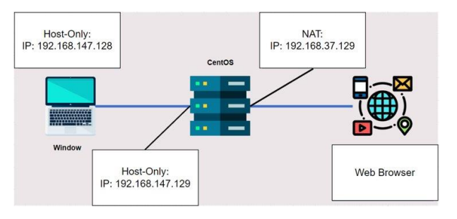

# Squid-Proxy
## Overview
Squid proxy contains 2 main elements in its configuration file:

• Access-list (ACL) elements: including lines that specify the object that needs 
access control and begin with the letter "acl"

• Access-list (ACL) rules: includes restrictions on the use of ACL Elements 
objects. ACL rules operate by individually comparing ACL elements to specified 
rules, if a match is found, the rule is applied and the comparison is immediately 
terminated. The logical and operation will be used to compare ruless that contain 
multiple ACL items ( all ACL elements must match the ACL rule )

## Deployment Architecture 

